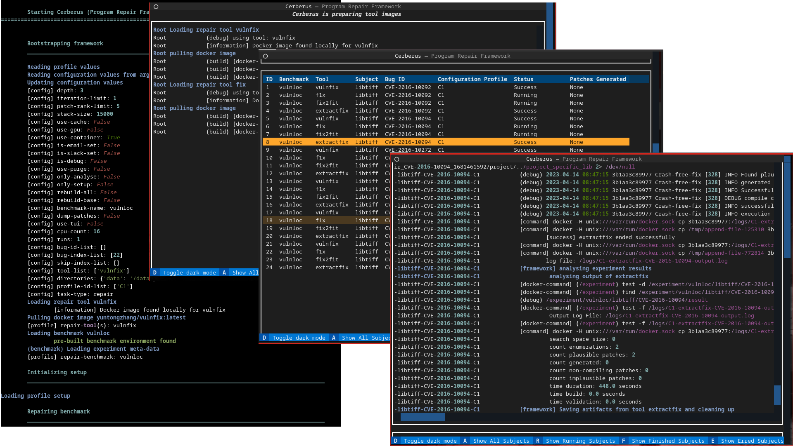

# Cerberus Framework




Cerberus is a research acceleration framework that provides the interface to multiple
state-of-the art program analysis tools such as Infer and Pulse, fuzzing tools such as AFL++, Jazzer as well as program repair tools such as F1X, SelfAPR etc.
Encapsulating the difficulties to setup the infrastructure for program analysis/repair technology, this platform provides
the necessary framework to configure a program for analysis/repair. We have integrated multiple defects
benchmarks including but not limited to ManyBugs, VulnLoc and Defects4J. This platform also provides the necessary means for researchers to
run experiments more efficiently and effectively, with more user-friendly features such as push notifications, and summary extraction.

## Highlights
* Empowered the First [International Program Repair Competition](https://apr-comp.github.io/) to evaluate the competing tools in Java, C and Python 
* Benchmarking platform used to run the Fuzzing Hackathon at the [Fuzzing and Software Security Summer School](https://fuzzing.comp.nus.edu.sg/Home.html).
* Automated student assignment grading for Masters Course [CS5219](https://nusmods.com/courses/CS5219/automated-software-validation) taught at NUS. 

## Features

* Execution of analysis/repair tools on benchmarks of bugs
* Configuration of the environment to execute analysis/repair tools properly on the bugs
* Concurrent execution of multiple analysis/repair tools
* Artifacts are extracted and stored for each experiment
* Push notification once experiments are completed

## Installation Procedure

When cloning the repository ensure that the submodules containing the benchmarks are initialized. There are two ways to do this:
* `git clone --recurse-submodules https://github.com/nus-apr/cerberus` to init when cloning the project
* or running `git submodule init && git submodule update` to initialize them post cloning (update can take in a specific path if one wants to initialize only one benchmark)

To ensure that Cerberus has all dependencies one has to run `pip install -r requirements.txt` before trying to use Cerberus.

## Using Cerberus

Following is a simple snippet for the command to run an experiment from a selected benchmark.

```bash
source activate
cerberus -task [analyze/repair] --bug-index=ID  --benchmark=[manybugs/vulnloc] --tool=[cpr/angelix/prophet/f1x]
```

## Supported Tools and Benchmark
Full list of supported [tools](doc/tool/ListTools.md) and [benchmarks](doc/benchmark/ListBenchmarks.md)

## Bugs

Cerberus should be considered alpha-quality software. Bugs can be reported here:

    https://github.com/nus-apr/cerberus/issues

## Documentation

* [Getting Started](doc/GetStart.md)
* [Example Usage](doc/Examples.md)
* [Manual](doc/Manual.md)
* [Extending](doc/Extending.md)
* [Project Architecture](doc/ProjectArchitecture.md)
* [Notifications](doc/Notifications.md)
* [Configuration file](doc/Configuration.md)


## Citation

If you use Cerberus in your research work, we would highly appreciate it if you
cited the [following paper](https://rshariffdeen.com/paper/ICSE23-demo.pdf):

```
@inproceedings{cerberus,
author = {Shariffdeen, Ridwan and Mirchev, Martin and Noller, Yannic and Roychoudhury, Abhik},
title = {Cerberus: A Program Repair Framework},
year = {2023},
booktitle = {Proceedings of the ACM/IEEE 45th International Conference on Software Engineering: Companion Proceedings},
location = {Melbourne, Australia},
series = {ICSE '23},
pages={73-77},
doi={10.1109/ICSE-Companion58688.2023.00028}
}
```
