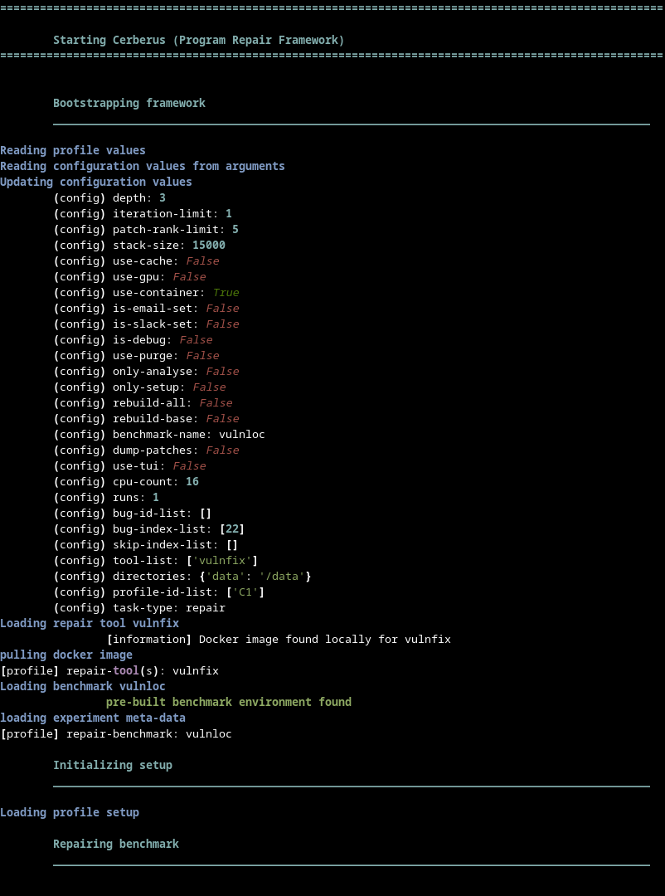
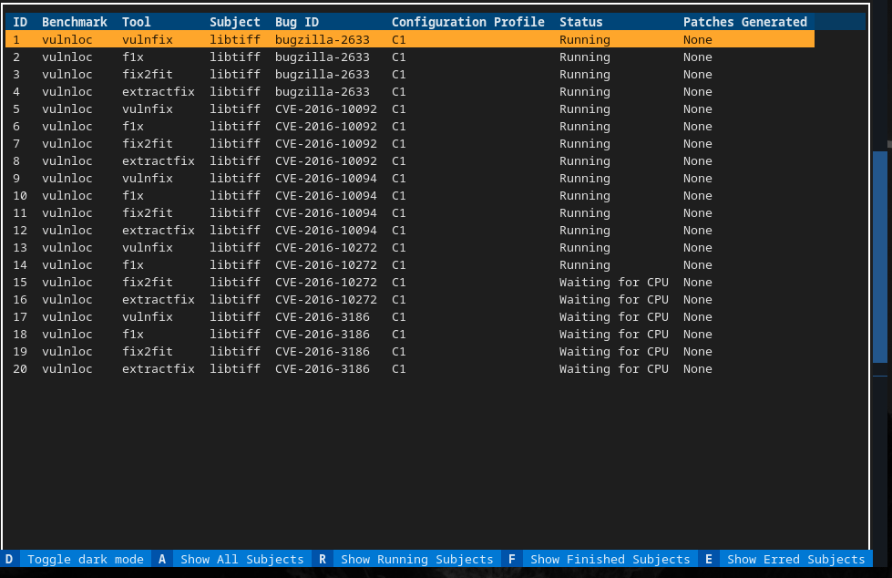

# Getting Started

Let's walk through a simple example and a more complicated one to understand how to use Cerberus. One will run a single experiment sequentially, while the latter will run multiple experiments on multiple tools.

Cerberus will do the following actions in order when given a tool list and experiment list:

* Pull the images for each tool in the list, if they are not found locally or are outdated;
* Prepare a image for the benchmark, if one was not already created;
* Prepare an image for each subject, if one was not already created.
* If sequentially running (by default), each experiment is ran on each tool in an isolated container (or locally if selected).

## Sequential execution

We consider the [libtiff project](https://github.com/vadz/libtiff/) from the VulnLoc benchmark as a medium-sized example.

```bash
    cerberus repair --tool vulnfix --benchmark=vulnloc --bug-index=22
```



We have selected to run the vulnfix tool on the 22nd bug of the vulnloc benchmark. Cerberus will prepare everything  needed and run the tool on the selected subject.

## Parallel execution

The becnhark has instrumentation setup for most of the C program repair tools currently integrated, thus we can test multiple tools and bugs in parallel and examine their results.

Let us run some of them - vulnfix, extractfix, f1x and fix2fit and 4 of the bugs.

```bash
    cerberus repair --tool-list vulnfix f1x fix2fit extractfix --benchmark=vulnloc --bug-index-list=22-26 -g
```

Cerberus will allocate 4*4 = 16 tasks and display 2 windows - the first one is the log of the currently selected task, this by default is the first allocated, and the second window is a table showing all tasks. If the `--debug` flag is passed there will is a third window collecting all textual messages from all tasks, showing the messages in chronological order.




Now Cerberus is running, one can easily filter the table by clicking on the buttons in the footer or click the accelerators or clicking on the different rows of the table to select the different text logs. By default Cerberus uses 2 less than the maximum amount of cores for task allocation to ensure that the system is not overloaded. One can easily change this amount with the `--cpus` flag and achieve sequential execution with the UI active by setting the cpus to 1.

The Status column can have various values and the common ones are "Allocated", "Running", "Waiting for CPU", "Successful", "Failed". Cerberus has a CPU allocation scheduling, which ensures that an experiment gets a cpu core.


## When complete

When running each tool, the output from the run of the tool is stored in the `output/artifacts` folder and the logs in the `output/logs`. Each experiment run has a unique identifier, which can be seen from the first lines of the output of Cerberus. The folder of the artifact contains patches, output of the tool and extra files if defined by the driver. One can also use the symbolic link `TOOL-vulnloc-bugzilla-2633-last` where `TOOL` is the respective name of the tool to more easily access the run. This is a concrete instance of the patern pattern `TOOL-BENCHMARK-EXPERIMENT-last`.
