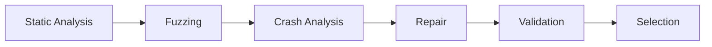

# Basic Workflow setup

## Usage
In the latest version of Cerberus, we have included the task type `composite`.
This task can only be used by providing a configuration file with the field `composite-sequence` in the chunk. Invocation through the CLI will fail when cerberus tries to run the tool.

UI mode usage - the current state of the Parallel workflow has not been tested in the UI mode. If there are crashes, contact Martin for support.

## Workflow order

The current setup is a hardcoded sequence of the order:

## Class Implementation

The base class implementing the workflow driver interaction with Cerberus is `AbstractCompositeTool.py` while the real interactions are in `BasicWorkflow.py`.

## Thread Pool specifics
`BasicWorkflow.py` currently creates a thread pool with 12 threads, 4 of which are usaged on message processing.
The reason for having multiple message processing tasks is that many files can be created in the same time.

## Workflow execution
When the workflow is started, an Observer, from the `watchdog` library will start watching a newly created folder in `composite_workspace` with the name `run-<hex_digest>` which is a unique folder for the current run of the tooling. By default, `BasicWorkflow` tries to create the first tool in the chain, from which to start the workflow. After a file change is observed i.e. a crash is created, result metadata is created, we start a set of the next tools in the chain. The starting of a new tool is done by pushing an instance of the `run_subtask` method to the thread pool. We have implemented handlers for every task's final output to analyze the metadata and react accordingly.

N.B. `BasicWorkflow.py` has duplicated code which later may be refactored when we have validated through usage that the deisgn is good.

## Termination
When all tasks finish, the last task sends an `exit_meesage_delayed` which informs the system to wait for a minute to check whether any tool will start in the next minute (this value can change depending on loads and known timing windows). If no tasks starts in the grace period, we can terminate the current instance of `BasicWorkflow`.